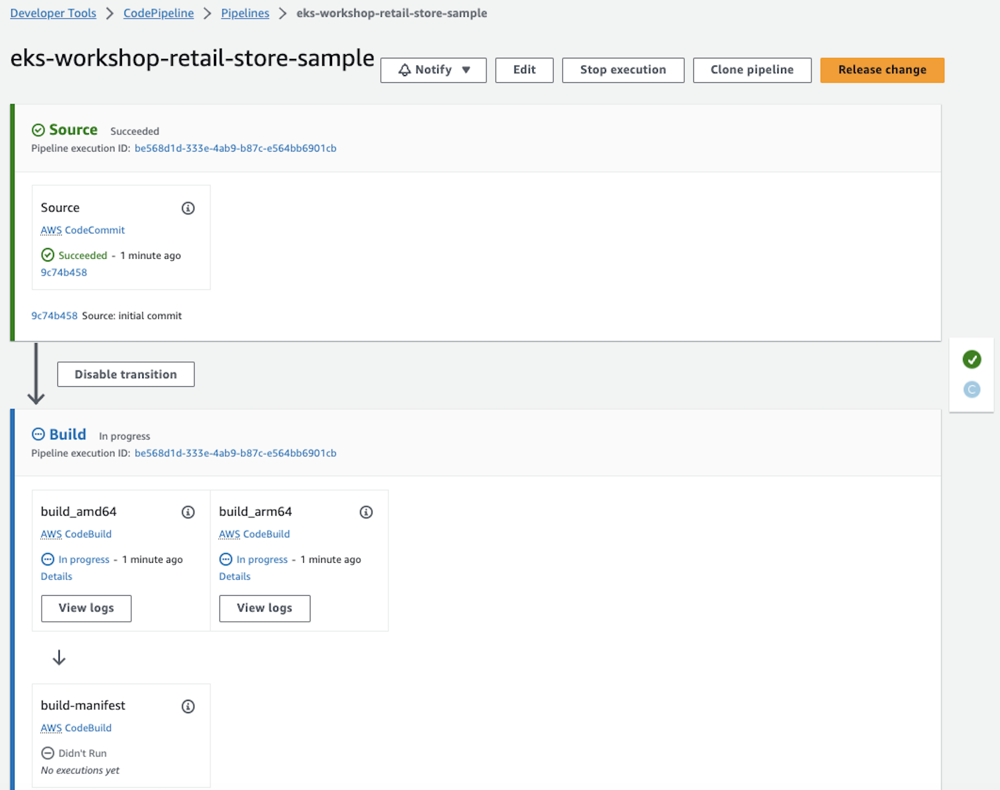
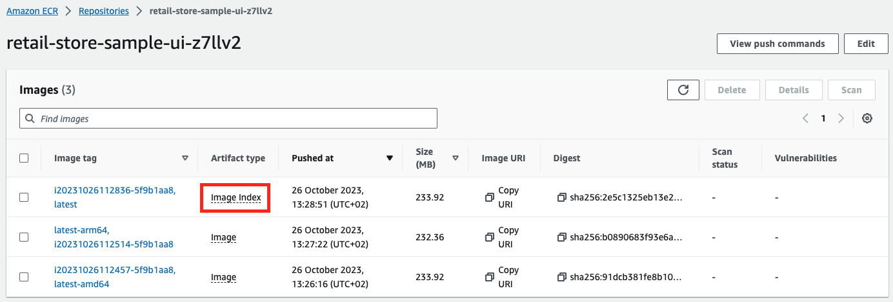
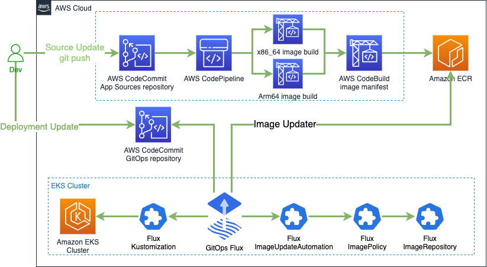
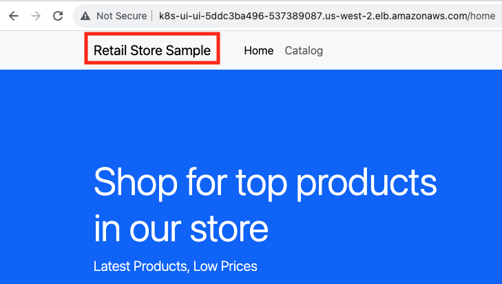
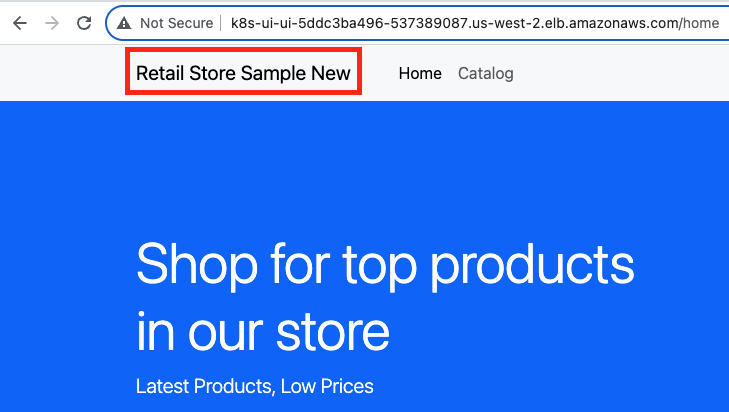

We have successfully bootstrapped Flux on EKS cluster and deployed the application. To demonstrate how to make changes in the source code an application, build a new container images and leverage GitOps to deploy a new image to a cluster we introduce Continuous Integration pipeline. We will leverage AWS Developer Tools and [DevOps principles](https://aws.amazon.com/devops/what-is-devops/) to build [multi-architecture container images](https://aws.amazon.com/blogs/containers/introducing-multi-architecture-container-images-for-amazon-ecr/) for Amazon ECR.

We created Continuous Integration Pipeline during the prepare environment step and now we need to make it up and running.


First, clone CodeCommit repository for the application sources:

```bash
$ git clone ssh://${GITOPS_IAM_SSH_KEY_ID}@git-codecommit.${AWS_REGION}.amazonaws.com/v1/repos/${EKS_CLUSTER_NAME}-retail-store-sample ~/environment/retail-store-sample-codecommit
```

Next, populate the CodeCommit repository with the sources from the public repository of the [Sample application](https://github.com/aws-containers/retail-store-sample-app):

```bash
$ git clone https://github.com/aws-containers/retail-store-sample-app ~/environment/retail-store-sample-app

$ git -C ~/environment/retail-store-sample-codecommit checkout -b main

$ cp -R ~/environment/retail-store-sample-app/src ~/environment/retail-store-sample-codecommit
$ cp -R ~/environment/retail-store-sample-app/images ~/environment/retail-store-sample-codecommit
```

We use AWS CodeBuild and define `buildspec.yml` to build new `x86_64` and `arm64` images in parallel.

```file
manifests/modules/automation/gitops/flux/buildspec.yml
```

```bash
$ cp ~/environment/eks-workshop/modules/automation/gitops/flux/buildspec.yml ~/environment/retail-store-sample-codecommit/buildspec.yml
```

We use AWS CodeBuild also to build `Image Index` for `multi-architecture image` using `buildspec-manifest.yml`

```file
manifests/modules/automation/gitops/flux/buildspec-manifest.yml
```

```bash
$ cp ~/environment/eks-workshop/modules/automation/gitops/flux/buildspec-manifest.yml ~/environment/retail-store-sample-codecommit/buildspec-manifest.yml
```

Now we are ready to push our changes to CodeCommit and start the CodePipeline

```bash
$ git -C ~/environment/retail-store-sample-codecommit add .
$ git -C ~/environment/retail-store-sample-codecommit commit -am "initial commit"
$ git -C ~/environment/retail-store-sample-codecommit push --set-upstream origin main
```
You can navigate to `CodePipeline` in AWS Console and explore `eks-workshop-retail-store-sample` pipeline.



As a result of a CodePipeline run with CodeBuild you will have a new image in ECR



While we are waiting for pipeline to create new images, let's [automate image updates to Git](https://fluxcd.io/flux/guides/image-update/) using Flux Image Automation Controller.

First, we need to install Flux components.

```bash
$ flux install --components-extra=image-reflector-controller,image-automation-controller
```

Next, edit file `deployment.yaml` and add placeholder for new container image url

```bash
$ git -C ~/environment/flux pull
$ sed -i 's/^\(\s*\)image: "public.ecr.aws\/aws-containers\/retail-store-sample-ui:0.4.0"/\1image: "public.ecr.aws\/aws-containers\/retail-store-sample-ui:0.4.0" # {"$imagepolicy": "flux-system:ui"}/' ~/environment/flux/apps/ui/deployment.yaml
```

Change to:

image: "public.ecr.aws/aws-containers/retail-store-sample-ui:0.4.0" `# {"$imagepolicy": "flux-system:ui"}`

Commit changes to deployment:

```bash
$ git -C ~/environment/flux add .
$ git -C ~/environment/flux commit -am "Adding ImagePolicy"
$ git -C ~/environment/flux push
```

We need to deploy custom resource definitions (ImageRepository, ImagePolicy, ImageUpdateAutomation) for Flux to enable monitoring of new container images in ECR and automated deployment using GitOps.

```bash
$ echo $IMAGE_URI_UI
$ cat <<EOF | envsubst | kubectl create -f -
apiVersion: image.toolkit.fluxcd.io/v1beta2
kind: ImageRepository
metadata:
  name: ui
  namespace: flux-system
spec:
  provider: aws
  interval: 1m
  image: ${IMAGE_URI_UI}
  accessFrom:
    namespaceSelectors:
      - matchLabels:
          kubernetes.io/metadata.name: flux-system
EOF
imagerepository.image.toolkit.fluxcd.io/ui created
```

```bash
$ cat <<EOF | kubectl create -f -
apiVersion: image.toolkit.fluxcd.io/v1beta2
kind: ImagePolicy
metadata:
  name: ui
  namespace: flux-system
spec:
  imageRepositoryRef:
    name: ui
  filterTags:
    pattern: '^i[a-fA-F0-9]'
  policy:
    alphabetical:
      order: asc
EOF
imagepolicy.image.toolkit.fluxcd.io/ui created
```

```bash
$ cat <<EOF | kubectl create -f -
apiVersion: image.toolkit.fluxcd.io/v1beta1
kind: ImageUpdateAutomation
metadata:
  name: ui
  namespace: flux-system
spec:
  git:
    checkout:
      ref:
        branch: main
    commit:
      author:
        email: fluxcdbot@users.noreply.github.com
        name: fluxcdbot
      messageTemplate: '{{range .Updated.Images}}{{println .}}{{end}}'
    push:
      branch: main
  interval: 1m0s
  sourceRef:
    kind: GitRepository
    name: flux-system
    namespace: flux-system
  update:
    path: ./apps
    strategy: Setters
EOF
imageupdateautomation.image.toolkit.fluxcd.io/ui created
```

We created the following architecture:



Now, lets reconcile the changes.

```bash
$ flux reconcile image repository ui
$ flux reconcile source git flux-system
$ flux reconcile kustomization apps
$ kubectl wait deployment -n ui ui --for condition=Available=True --timeout=120s
$ git -C ~/environment/flux pull
$ kubectl -n ui get pods
```

We can check that `image:` in the `deployment` has been updated to a new tag.

```bash
$ kubectl -n ui describe deployment ui | grep Image
```

To access `UI` using a browser we need to expose it using `Ingress` and `Load Balancer`.

Let's create an Ingress resource with the following manifest:

```file
manifests/modules/exposing/ingress/creating-ingress/ingress.yaml
```

This will cause the AWS Load Balancer Controller to provision an Application Load Balancer and configure it to route traffic to the Pods for the `ui` application.

```bash timeout=180
$ kubectl apply -k ~/environment/eks-workshop/modules/exposing/ingress/creating-ingress
```

Let's inspect the Ingress object created:

```bash
$ kubectl get ingress ui -n ui
NAME   CLASS   HOSTS   ADDRESS                                            PORTS   AGE
ui     alb     *       k8s-ui-ui-1268651632.us-west-2.elb.amazonaws.com   80      15s
```

We wait 2-5 minutes until Application Load Balancer will be provisioned and check the UI page using url of the ingress.

```bash test=false
$ export UI_URL=$(kubectl get ingress -n ui ui -o jsonpath="{.status.loadBalancer.ingress[*].hostname}{'\n'}")
$ curl $UI_URL/home | grep "Retail Store Sample"
  % Total    % Received % Xferd  Average Speed   Time    Time     Time  Current
                                 Dload  Upload   Total   Spent    Left  Speed
        <title>Retail Store Sample App</title>
100                <a class="navbar-brand" href="/home">Retail Store Sample</a>
 13254  100 13254    0     0   236k      0 --:--:-- --:--:-- --:--:--  239k
```



Let's introduce changes to the source code of the Sample Application.

Edit the file:

```bash
$ sed -i 's/\(^\s*<a class="navbar-brand" href="\/home">\)Retail Store Sample/\1Retail Store Sample New/' ~/environment/retail-store-sample-codecommit/src/ui/src/main/resources/templates/fragments/layout.html
```

Change line 24

`<a class="navbar-brand" href="/home">Retail Store Sample</a>` to `<a class="navbar-brand" href="/home">Retail Store Sample New</a>`

Commit changes.

```bash
$ git -C ~/environment/retail-store-sample-codecommit status
$ git -C ~/environment/retail-store-sample-codecommit add .
$ git -C ~/environment/retail-store-sample-codecommit commit -am "Update UI src"
$ git -C ~/environment/retail-store-sample-codecommit push
```

Wait until CodePipeline will build the new image and Flux will deploy it.

```bash test=false
$ kubectl -n ui describe deployment ui | grep Image
$ # aws codepipeline start-pipeline-execution --name eks-workshop-retail-store-sample
$ # sleep 10
$ while [[ "$(aws codepipeline get-pipeline-state --name eks-workshop-retail-store-sample --query 'stageStates[1].actionStates[0].latestExecution.status' --output text)" != "InProgress" ]]; do echo "Waiting for pipeline to start ..."; sleep 10; done && echo "Pipeline started."
$ while [[ "$(aws codepipeline get-pipeline-state --name eks-workshop-retail-store-sample --query 'stageStates[1].actionStates[2].latestExecution.status' --output text)" != "Succeeded" ]]; do echo "Waiting for pipeline to reach 'Succeeded' state ..."; sleep 10; done && echo "Pipeline has reached the 'Succeeded' state."

$ flux reconcile image repository ui
$ sleep 5
$ flux reconcile source git flux-system
$ flux reconcile kustomization apps
$ kubectl wait deployment -n ui ui --for condition=Available=True --timeout=120s
$ git -C ~/environment/flux pull
$ kubectl -n ui get pods

$ kubectl -n ui describe deployment ui | grep Image

$ export UI_URL=$(kubectl get ingress -n ui ui -o jsonpath="{.status.loadBalancer.ingress[*].hostname}{'\n'}")
$ while [[ $(curl -s -o /dev/null -w "%{http_code}" $UI_URL/home) != "200" ]]; do sleep 1; done
$ curl $UI_URL/home | grep "Retail Store Sample"
  % Total    % Received % Xferd  Average Speed   Time    Time     Time  Current
                                 Dload  Upload   Total   Spent    Left  Speed
10        <title>Retail Store Sample App</title>
                <a class="navbar-brand" href="/home">Retail Store Sample New</a>
0 13258  100 13258    0     0   289k      0 --:--:-- --:--:-- --:--:--  294k
```

After successful build and deployment (5-10 minutes) we will have the new version of UI application up and running.


