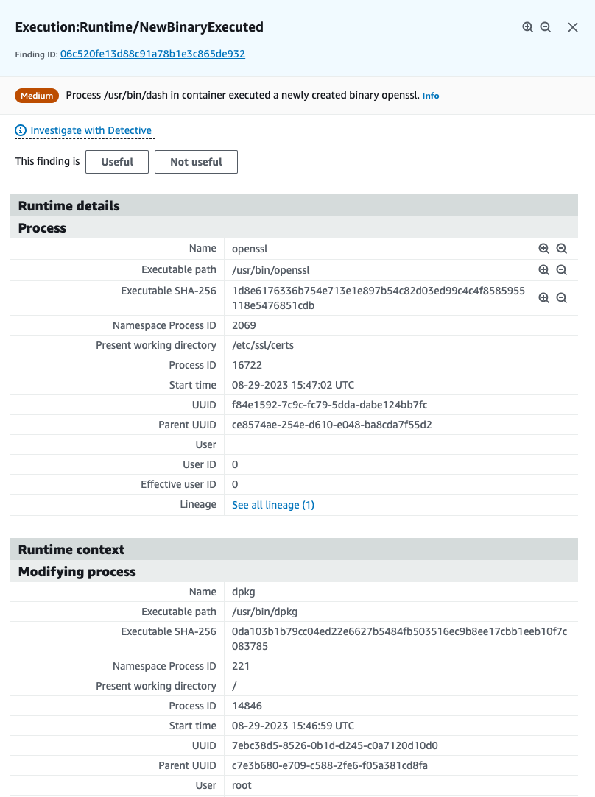
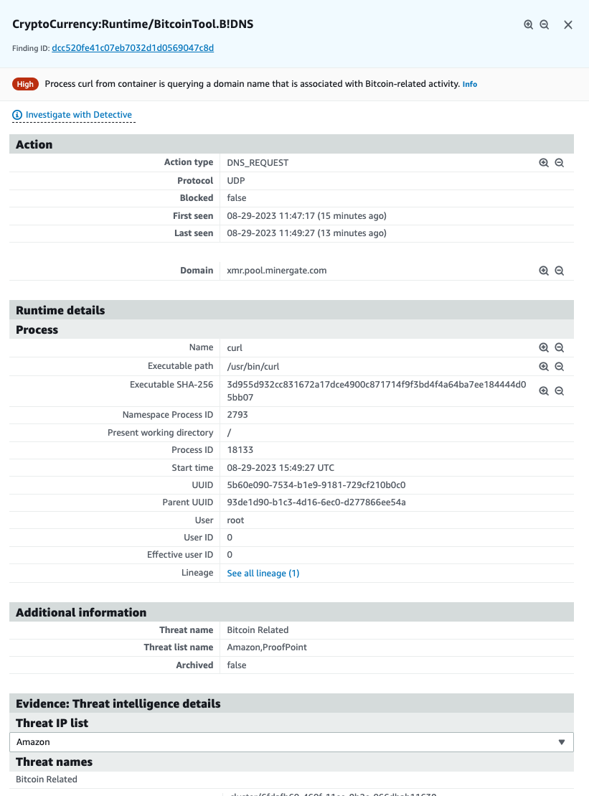

This finding indicates that a container tried to do a cryto mining inside a Pod.

To simulate the finding we'll be running a `ubuntu` image Pod in the `default` Namespace using the interactive mode, and from there run a couple of commands to start a crypto mining process, as an attacker would do.

Run the below command to run the Pod in an interactive mode.

```bash
$ kubectl run -ti crypto --image ubuntu --rm --restart=Never
```

Inside the Pod, run the following commands to simulate a crypto miniing process.

```bash
$ apt update && apt install -y curl
$ curl -s http://pool.minergate.com/zaq12wsxcde34rfvbgt56yhnmju78iklo90p /dev/null &
$ curl -s http://xmr.pool.minergate.com/p09olki87ujmnhy65tgbvfr43edcxsw21qaz  > /dev/null &
```

These commands will trigger three different findings in the [GuardDuty Findings console](https://console.aws.amazon.com/guardduty/home#/findings).

First one is `Execution:Runtime/NewBinaryExecuted`, which is related to the `curl` package installating via APT tool.



Take a closer look to the details of this findings, because they are related to the GuardDuty Runtime monitoring, it shows specific information regarding the Runtime, Context, and Processes.

Second and third ones, are `CryptoCurrency:Runtime/BitcoinTool.B!DNS` findings. Notice again that the finding details brings different information, this time showing the DNS_REQUEST action, and the **Threat inteligene Evidences**.


